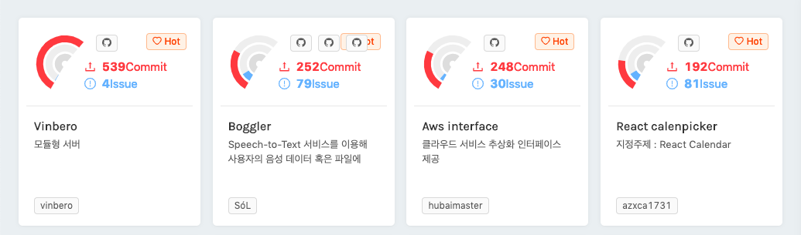

# 🎙 Boggler

[한국어](README-KR.md)

It started in Dec 26, 2018

[The 6th D2 CAMPUS FEST Final Entry Project](https://github.com/D2CampusFest/6th) - in Naver D2

in [The Naver D2 fest finalist progress board](https://d2campusfest6th-2019.herokuapp.com/)

## ❓ What is Boggler?

Boggler's main point is that it analyzes the audio information that is streamed or entered into a file and converts it into text. For example, a conversation in a meeting or a speaker's voice is converted into text to provide a better typing environment.

## 💡 Motivation

Sometimes we listen to lectures or record important things. However, there is the inconvenience that such recorded material should be written in text. In addition, this task is easily forgotten unless it is absolutely necessary.

Boggler is being created as a tool to reduce the fatigue of work to convert speech to text.

## History by Feb 19, 2019([Boggler](https://github.com/teamthesol/boggler), [Node-DeepSpeech](https://github.com/teamthesol/node-DeepSpeech))

## 💅 Style Demo

CodeSandbox does not support the core tools in this project, the deepSpeech and the waveform package, so you can only see style demos.

## 🏃‍♂️🏃‍♀️ Quickstart

> \$ yarn // or npm install
>
> // Installing node modules
>
> \$ yarn pre // or npm run pre
>
> // Installing pre-files(models, audio samples) and unzip tar.gz
>
> \$ yarn start // or npm run start
>
> // Start the frontend and the backend Server

## 🚀 Usage

## 🔧 Used Opensource Tools

Boggler basically used the React boilerplate [create-react-app](https://github.com/facebook/create-react-app) to organize the project's framework and used a variety of tools, including:

### Main Tools

- [Node-DeepSpeech](https://github.com/teamthesol/ndoe-DeepSpeech) - MPL 2.0
- [React](https://github.com/facebook/react) - MIT
- [Node](https://github.com/nodejs/node) - MIT

### Etc. - MIT

#### Developer-env tools

- [Vscode](https://github.com/Microsoft/vscode)
- [Eslint](https://github.com/eslint/eslint)
- [Prettier](https://github.com/prettier/prettier)

#### Front-end tools

- [Styled-components](https://github.com/styled-components/styled-components)
- [Open-color](https://github.com/yeun/open-color)
- [Prop-types](https://github.com/facebook/prop-types)
- [Enzyme](https://airbnb.io/enzyme/)
- [Jest](https://jest-bot.github.io/jest/)

#### Back-end tools

- [Nodemon](https://github.com/remy/nodemon)
- [Concurrently](https://github.com/kimmobrunfeldt/concurrently)
- [Express](https://github.com/expressjs/express)
- [Axios](https://github.com/axios/axios)
- [Body-parser](https://github.com/expressjs/body-parser)
- [Concurrently](https://github.com/kimmobrunfeldt/concurrently#readme)
- [Codemirror](https://codemirror.net/)
- [Markdown-pdf](https://github.com/alanshaw/markdown-pdf)

#### Video provision(Git History)

- [Gource](https://gource.io/)

## How can I contribute to this project?

First, read the [our contribution guideline](CONTRIBUTING.md). if you have read it, you can contribute to our project by creating [issues](https://github.com/teamthesol/boggler/issues) or contribute to it in [pull requests](https://github.com/teamthesol/boggler/pulls).

## License

we follow MIT and (partial)MPL 2.0 [License](LICENSE).
